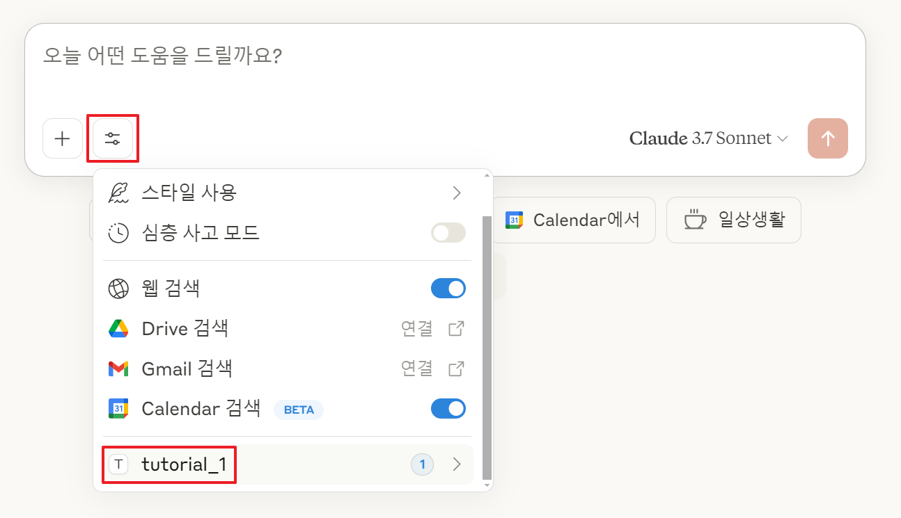
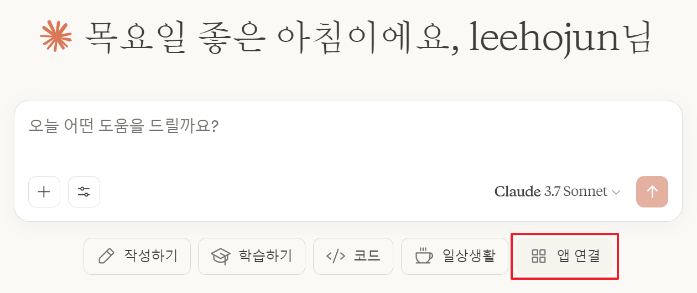
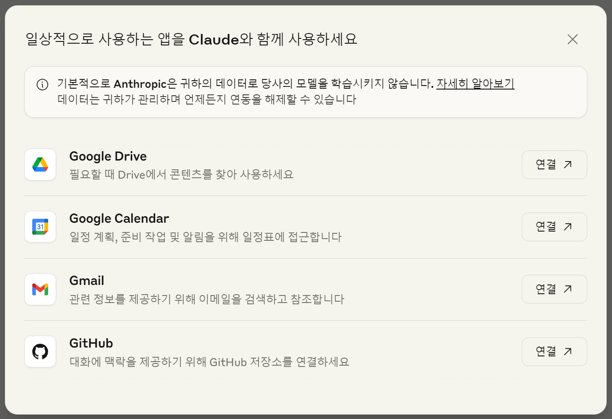
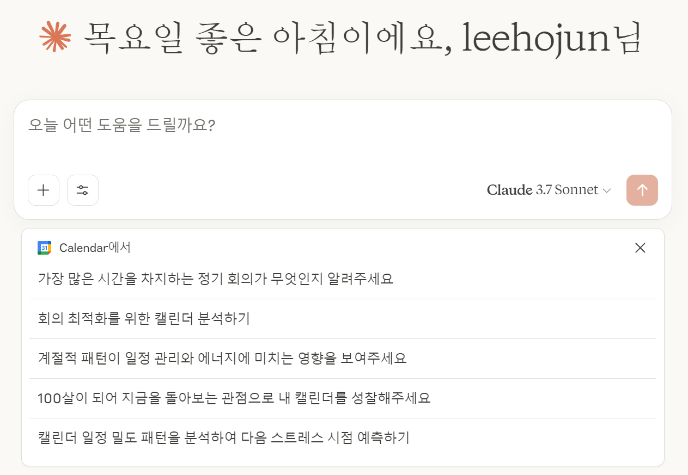

# mcp_book_source

해당 책은 전자책으로는 'MCP 혁신'이라는 이름으로 종이책으로는 '10분 만에 따라 하는 Claude MCP 업무 자동화 혁신 가이드'라는 이름으로 출간되었습니다. 이 두책은 대부분 동일한 내용입니다. 전자책은 업데이트를 주기적으로 하고 있고, 종이책은 전자책보다 더 초급자에게 상세하고 친절한 설명이 들어가 있습니다.

## 종이책 안내

* 종이책 코드는 `paper` 폴더에 있습니다.
* 다운로드는 현재 페이지 오른쪽 상단에 `Code` 버튼 클릭 후 `Download ZIP`을 클릭하여 다운로드 받으실 수 있습니다.
* 종이책 전체 압축 파일은 아래 링크를 클릭하신 후 오른쪽 상단에 `Download raw file` 버튼을 클릭하시면 다운로드 받으실 수 있습니다.
    * 종이책 압축파일 링크: [mcp_book_source_paper.zip](https://github.com/weniv/mcp_book_source/blob/main/paper.zip)

## 전자책 안내

* 해당 책은 한국어, 영어, 일본어로 번역된 책입니다. 이 책에 내용은 매달 업데이트 되고 있으나, 일부 언어나 배포사에 따라 업데이트가 늦어지거나 안될 수 있습니다. 따라서 이곳에 업데이트 내역을 정리합니다.

* This book is translated into Korean, English, and Japanese. The content of this book is updated every month, but the update may be delayed or not done depending on the language or distribution. Therefore, we will organize the update history here.

* この本は韓国語、英語、日本語に翻訳された本です。この本の内容は毎月更新されますが、一部の言語や配布によって更新が遅れたり、行われない場合があります。したがって、ここに更新履歴を整理します。

- 한문
   - 리디북스 : https://ridibooks.com/books/2773000106
   - 교보문고 : https://ebook-product.kyobobook.co.kr/dig/epd/ebook/E000011285165
   - 알라딘 : http://aladin.kr/p/3RIne
   - Yes24 : https://www.yes24.com/product/goods/147734827
- 영문 AMAZON : https://www.amazon.com/dp/B0F4QS4S6D
- 일문 AMAZON : https://www.amazon.co.jp/dp/B0F314DJ95

## 2025 / 5 / 8 Update

### 1 Update

* Python 13 버전 이상이어야만 예제가 정상 동작됩니다.

* The example works only with Python version 13 or higher.

* 例はPython13バージョン以上でのみ正常に動作します。

### 2 Update

* UI가 변했습니다. 이제 망치 버튼과 콘센트 버튼이 없고, 설정 버튼이 생겼습니다. 위 이미지를 참고하세요.

* The UI has changed. Now there is no hammer button and socket button, and a setting button has been added. Please refer to the image above.

* UIが変わりました。今はハンマーボタンとソケットボタンがなくなり、設定ボタンが追加されました。上の画像を参照してください。

### 3 Update

* 한국 시간으로 2025년 4월 16일 클로드의 공식 기능으로 구글 캘린더 연동, 구글 드라이브 연동, 구글 메일 연동, 깃헙 연동, 웹 검색 기능이 추가되었습니다. 위 이미지처럼 연동이 가능합니다. 다만 그렇다 하더라도 아직까지 구글 드라이브에 내용을 생성, 수정, 삭제, 이동, 복사하는 기능은 지원하지 않습니다. 따라서 앞으로도 MCP의 역할이 분명 있을 것으로 보여집니다.

* Google Calendar integration, Google Drive integration, Google Mail integration, GitHub integration, and web search function were added as an official feature of Claude on April 16, 2025. Integration is possible as shown in the image above. However, even so, the function of creating, modifying, deleting, moving, and copying content in Google Drive is not yet supported. Therefore, it seems that there will still be a clear role for MCP.

* 2025年4月16日、Googleカレンダーの統合、Googleドライブの統合、Googleメールの統合、GitHubの統合、Web検索機能がClaudeの公式機能として追加されました。上記の画像のように統合が可能です。ただし、それでもGoogleドライブにコンテンツを作成、変更、削除、移動、コピーする機能はまだサポートされていません。したがって、今後もMCPの役割が明確にあると思われます。

### 4 Update

* 5월 초에는 다양한 외부 앱 연동 기능인 'Integrations'를 출시하였습니다. Jira, Zapier 등 10개의 서비스부터 지원합니다.

* In early May, we launched the 'Integrations' feature, which integrates various external apps. It supports 10 services, including Jira and Zapier.

* 5月初めには、さまざまな外部アプリ統合機能「Integrations」を発売しました。Jira、Zapierなど10のサービスからサポートしています。

### 5 Update

* Notion MCP Server 가져와서 설치하기, Excel MCP Server 가져와서 설치하기 챕터가 추가되었습니다. 이 챕터는 한국어로만 작성되었습니다. 아래 챕터 링크를 추가합니다.
    * 링크: [Notion MCP Server 가져와서 설치하기](https://paullabworkspace.notion.site/4-1-Notion-MCP-Server-1edebf76ee8a8001a12ffe15d67b1b23?pvs=4)
    * 링크: [Excel MCP Server 가져와서 설치하기](https://paullabworkspace.notion.site/4-2-Excel-MCP-Server-1edebf76ee8a80debf15c6ee230c3ca6?pvs=4)

### 6 Update
* 25년 6월 초 MCP 통합이라는 기능이 출시되었습니다. 코드 없이 MCP를 추가할 수 있는 기능입니다. 이 챕터는 한국어로만 작성되었습니다. 아래 챕터 링크를 추가합니다.
    * 링크: [MCP 통합](https://paullabworkspace.notion.site/MCP-20bebf76ee8a8078afc0ed36439ea00c?source=copy_link)