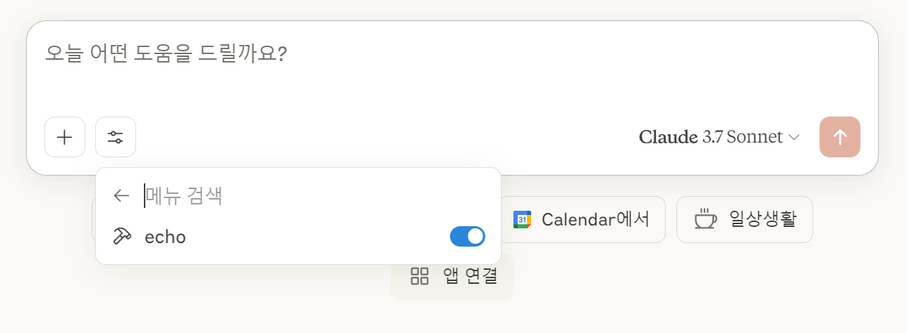

# mcp_book_source

* 해당 책은 한국어, 영어, 일본어로 번역된 책입니다. 이 책에 내용은 매달 업데이트 되고 있으나, 일부 언어나 배포사에 따라 업데이트가 늦어지거나 안될 수 있습니다. 따라서 이곳에 업데이트 내역을 정리합니다.

* This book is translated into Korean, English, and Japanese. The content of this book is updated every month, but the update may be delayed or not done depending on the language or distribution. Therefore, we will organize the update history here.

* この本は韓国語、英語、日本語に翻訳された本です。この本の内容は毎月更新されますが、一部の言語や配布によって更新が遅れたり、行われない場合があります。したがって、ここに更新履歴を整理します。

## 2025 / 5 / 8 Update

### 1

* Python 13 버전 이상이어야만 예제가 정상 동작됩니다.

* The example works only with Python version 13 or higher.

* 例はPython13バージョン以上でのみ正常に動作します。

### 2

* UI가 변했습니다. 이제 망치 버튼과 콘센트 버튼이 없고, 설정 버튼이 생겼습니다. 위 이미지를 참고하세요.

* The UI has changed. Now there is no hammer button and socket button, and a setting button has been added. Please refer to the image above.

* UIが変わりました。今はハンマーボタンとソケットボタンがなくなり、設定ボタンが追加されました。上の画像を参照してください。